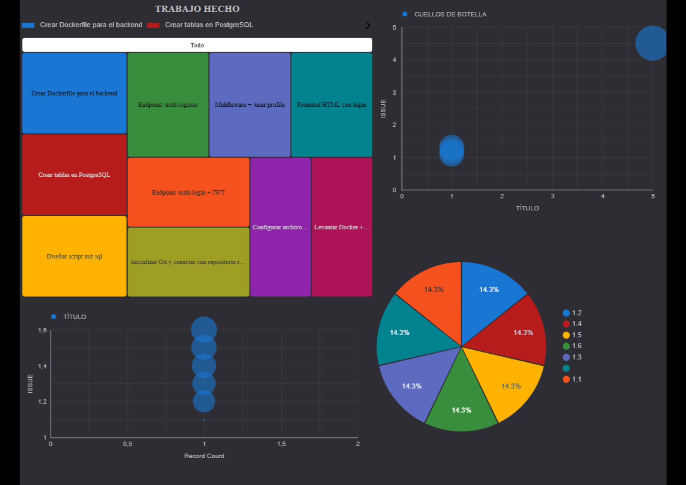

# Proyecto: 1DflfRMH - Ecosistema NepoPetro

## Presentación del Proyecto

Esta plataforma es un **caso de estudio de ingeniería** que demuestra el ciclo completo del dato: desde la autenticación de usuarios hasta la observabilidad y la analítica. No es un simple sistema de login, sino una **arquitectura diseñada para la escalabilidad, la calidad y la gobernanza de datos**.

** Objetivo:** Construir un sistema de identidad que genere datos valiosos para la toma de decisiones, integrando desarrollo backend, automatización de pruebas, monitoreo y visualización analítica.

---

## Equipo

| **Rol** | **Nombre** | **Responsabilidades** |
| :--- | :--- | :--- |
| **Data Architect & Governant** | Victoria | Diseño de arquitectura, gobernanza de datos, backend y base de datos. |
| **QA Lead** | Gastón | Estrategia de testing, automatización, calidad del producto y gestión del backlog. |
| **DataOps Lead** | Vivianne | Pipeline de datos, monitoreo, métricas, calidad del dato y coordinación estratégica. |

---

## Sigue la Evolución del Proyecto en Tiempo Real

El proyecto está en desarrollo activo. Podés acompañar el progreso a través del **dashboard interactivo**, que se actualiza automáticamente con cada entrega y métrica clave.

**[Ver Dashboard Interactivo](https://datastudio.google.com/reporting/f54bdb35-b705-4d7a-9fc3-b0cbb7c1cbcd)**  

*Captura del dashboard en tiempo real. Haz clic en el enlace para explorarlo de forma interactiva.*

---

## Estado Actual del Sprint

| **Sprint** | **Objetivo** | **Estado** | **Entregas Completadas** |
|:---|:---|:---:|:---|
| **Sprint 1** | Infraestructura y Registro de Usuarios | ✅ 100% | 6 de 6 |
| **Sprint 2** | Autenticación JWT y Biometría | ⏳ 0% | 0 de 6 |
| **Sprint 3** | Automatización y Calidad | ⏳ 0% | 0 de 6 |
| **Sprint 4** | Gobernanza y Escalabilidad | ⏳ 0% | 0 de 6 |

---

## Tecnologías Utilizadas

- **Backend:** Node.js, Express, JWT, bcrypt
- **Base de Datos:** PostgreSQL
- **Infraestructura:** Docker, Docker Compose
- **Testing:** Mocha, Chai, Playwright, Newman, Pact
- **CI/CD:** GitHub Actions
- **Observabilidad:** Grafana, Looker Studio
- **Visual Analytics:** Google Looker Studio, Power BI (próximamente)

---

## Documentación y Evidencias

- [Evidencias de Victoria](evidencias/victoria/)
- [Evidencias de Gastón](evidencias/gaston/)
- [Evidencias de Vivianne](evidencias/vivianne/)
- [Evidencias del Equipo](evidencias/team/)

---

> **Nota:** Este README se actualiza a medida que el proyecto avanza. El dashboard interactivo refleja el estado más reciente del desarrollo.